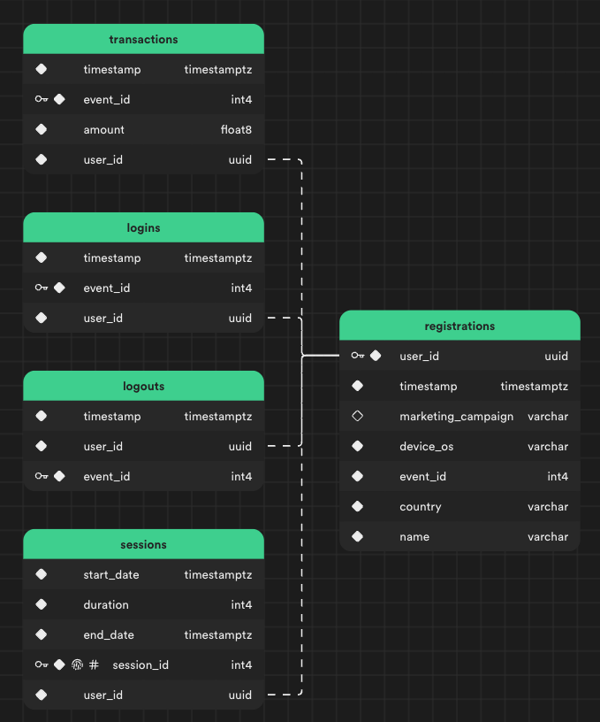

<h1 align="center">Nordeus data engineering challenge</h1>

# Data cleanup

This project was created using [Bun](https://bun.sh) v1.0.12.

To install dependencies:

```bash
bun install
```

To run:

```bash
bun run index.ts dataset/events.jsonl dataset/exchange_rates.jsonl
```

You'll get data exported to 5 separete CSV files located in `output` directory grouped by event type + CSV containing pre-computed sessions based on logins and logouts.

For this example I'll be using Supabase as my database. After creating Supabase project I created tables as shown in the schema below, imported generated CSVs and created indexes for `transactions`, `logins`, `logouts` and `sessions` based on `user_id` to optimize reads.



_Database schema_

# API

As for the API I implemented only the user info service using Supabase Edge Functions.

To deploy `user-service` edge function use supabase CLI:

```bash
bunx supabase functions deploy user-service --no-verify-jwt
```

## Live version is available at:

https://tzjxnfbrvqmogxyphvru.supabase.co/functions/v1/user-service

### API usage:

UUID:

https://tzjxnfbrvqmogxyphvru.supabase.co/functions/v1/user-service/{uuid}

UUID + DATE:

https://tzjxnfbrvqmogxyphvru.supabase.co/functions/v1/user-service/{uuid}/{date}

### Examples:

UUID:

https://tzjxnfbrvqmogxyphvru.supabase.co/functions/v1/user-service/6fc81560-683b-11ee-aca7-8699b86be788

UUID + DATE:

https://tzjxnfbrvqmogxyphvru.supabase.co/functions/v1/user-service/6fc81560-683b-11ee-aca7-8699b86be788/2010-05-21

<hr/>

# Conclusions

This was very fun challenge and great learning opportunity. Although I didn't finish the challenge and was late to it I really enjoyed it.

Is this code any good.. **NO**, could this attempt be improved.. **definitely**.

What would I change if I had more time:

- Actually finish the whole thing
- Optimize cleanup script
- Use actual SQL queries for the API instead of relying on Supabase client
- Add validation and error handling to the API
- Just make everything better

I learned a lot working on this and I'm happy I took the time to attempt it 😁
